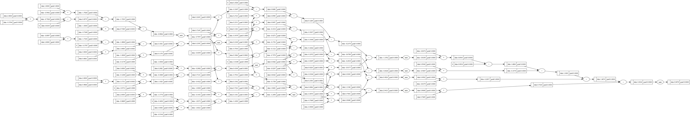
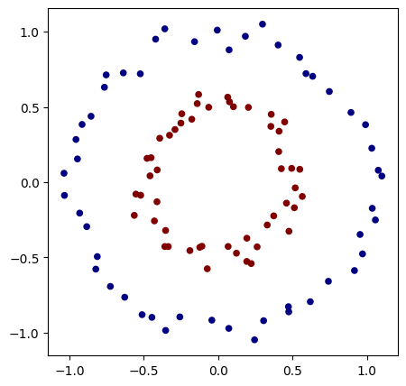
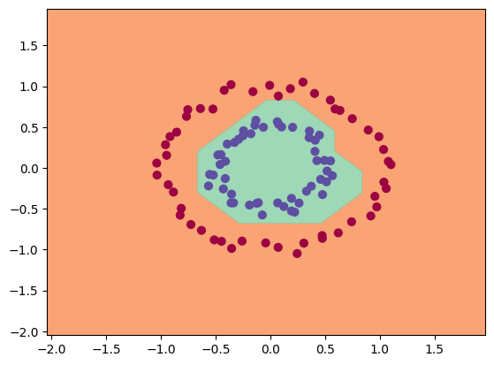

# Micrograd

## Scratch Implementation of Neural Nets. 
Components implemented: 
- **Values** (simple copy of Tensors in Pytorch) that can only handle Scalar values.
- **Backward Pass** by learning to do it first manually for each Values then automating it for the all Values.
- **Visualization** of Backpropogation using Graphviz
- **Building a basic MLP**

## Visualization

## Demo Training

## Credits:
Followed the tutorial by Andrej Karpathy, check out his youtube channel- https://www.youtube.com/@AndrejKarpathy.
This project is the first of his video series "Makemore", which i am gonna implement all and upload! 
